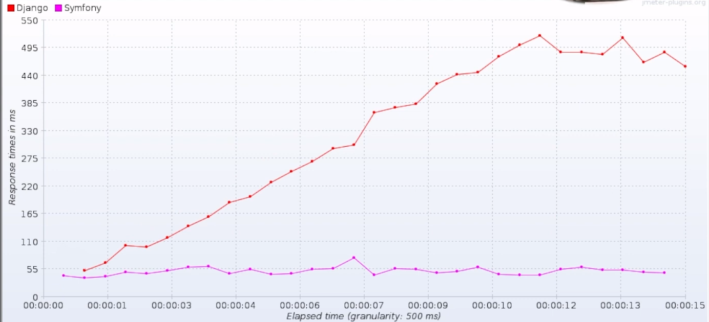
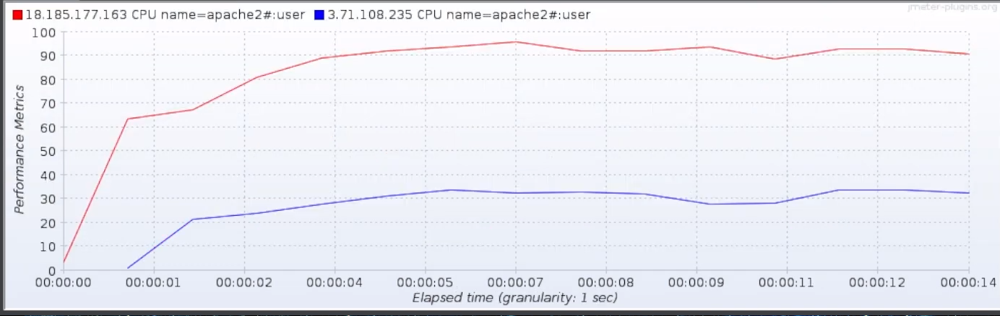
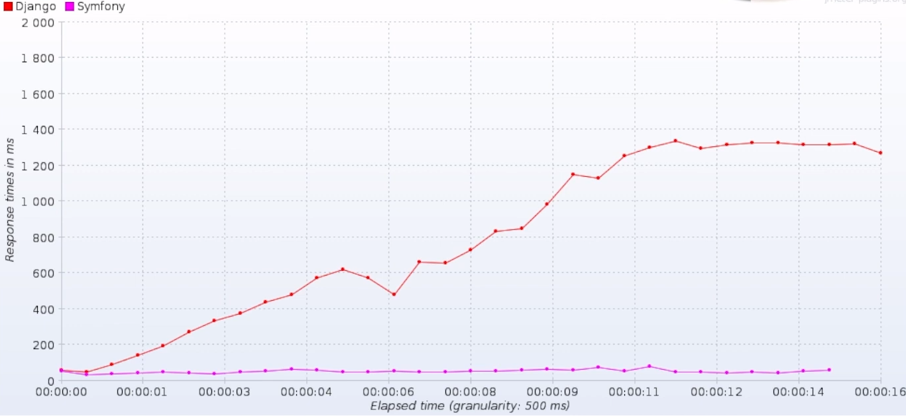
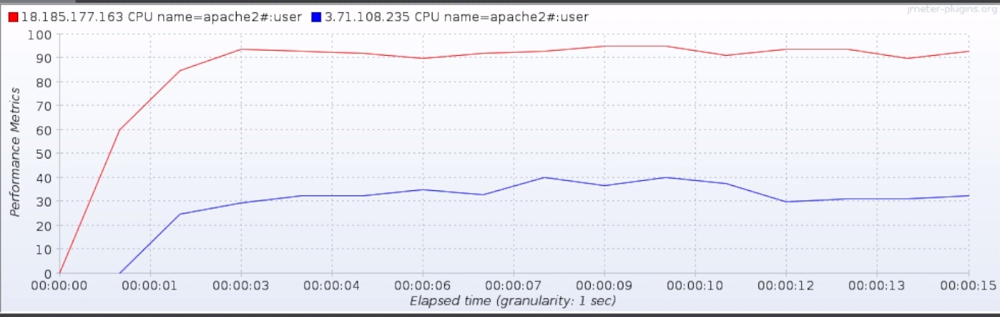

# Symfony vs Django

### Table of contents
- [Description](#description)
- [Project structure](#project-structure)
- [Requirements](#requirements)
- [Installation](#installation)
- [Benchmarking with Jmeter](#benchmarking-with-jmeter)

## Description
This repository contains two simple applications written in Symfony and Django. The goal is to compare the performance of both frameworks.
Both applications has the same functionality: displaying a list of questions and related choices, and has the bare minimum requirements of an MVC application:
- Models: ORM and Connecting to a database
- Views: using a template engine
- Controllers: using the a kind of routing mechanism

## Project structure
- apache_virtualhosts: contains the apache virtual hosts configuration files
- django_site: contains the django application
- mysql_dumps: contains the mysql database dump
- symfony_app: contains the symfony application
- jmeter: contains the jmeter configuration files


## Requirements
- Apache2, with mod_php-fpm, mod_wsgi and mod_rewrite enabled
- MySQL 8.0
- Python 3.8
- pipenv
- virtualenv
- PHP 8.2
- Composer
- Jmeter

## Installation

### Database
1. Create a database
```bash
mysqladmin -u root -p create django_symfony
```

3. Create a user
```bash
mysql -u root -p
mysql> CREATE USER 'django_symfony'@'localhost' IDENTIFIED BY 'django_symfony';
mysql> GRANT ALL PRIVILEGES ON django_symfony.* TO 'django_symfony'@'localhost';
```

4. Import the database
```bash
cd mysql_dumps
mysql -u django_symfony -p django_symfony < django_symfony.sql
# password: django_symfony
```

### Django
#### Installation
1. Create a virtual environment
```bash
vitualenv -p python3.10 .venv
```
2. Activate the virtual environment
```bash
pipenv shell
```

3. Install the requirements
```bash
pipenv install
sudo chown -R www-data:www-data django_site
```

#### Server configuration
1. adjust the apache_virtualhosts/django_app.conf file to your needs
2. copy it to the apache configuration directory:
```bash
cd apache_virtualhosts
sudo cp django_app.conf /etc/apache2/sites-available/django_app.conf
```

3. Enable the site
```bash
sude a2dissite 000-default.conf
sudo a2ensite django_app.conf
sudo systemctl reload apache2
```

### Symfony
#### Installation
1. Install the dependencies
```bash
composer install --no-dev --optimize-autoloader
```

2. Clear/Generate the cache
```bash
APP_ENV=prod APP_DEBUG=0 php bin/console cache:clear
# insure permissions are correct
sudo chown -R www-data:www-data var # or sudo chmod -R 777 var
```

#### Server configuration
1. adjust the apache_virtualhosts/symfony_app.conf file to your needs
2. copy it to the apache configuration directory:
```bash
cd apache_virtualhosts
sudo cp symfony_app.conf /etc/apache2/sites-available/symfony_app.conf
```

3. Enable the site
```bash
sudo a2ensite symfony_app.conf
# disable python app
sudo a2dissite django_app.conf
sudo a2dissite 000-default.conf
sudo systemctl reload apache2
```

# Benchmarking with Jmeter

1. Install [Jmeter](https://jmeter.apache.org)
2. Install the [Jmeter plugins manager](https://jmeter-plugins.org/wiki/PluginsManager/)
3. Install the [Jmeter PerfMon plugin](https://jmeter-plugins.org/wiki/PerfMon/)
4. Lunch PerfMon Agent on the server
```bash
./jmeter/ServersAgent-2.2.3/startAgent.sh
# as default, the agent will listen on port 4444
```
5. Adjust the Jmeter configuration to your needs from ./jmeter/TestPlan.jmx

[](https://www.youtube.com/watch?v=RuE8O7cw1yc "Open youtube video: Django vs Symfony")


### Results:
Servers specifications:
- ec2 instances (t2.micro) 1 vCPU, 1GB RAM

#### Settings
- 20 concurrent users
- ramp-up period: 10 seconds
- duration: 15 seconds

#### Response time over time:


#### Perfmom metrics:

red: Django
blue: Symfony

#### Settings
- 50 concurrent users
- ramp-up period: 10 seconds
- duration: 15 seconds

#### Response time over time:


#### Perfmom metrics:


#### Settings
How many concurrent users can the applications handle before reaching 90% of CPU usage?

The results are:
- Django: 10
- Symfony: 180

## Conclusion
as Objective as I can be, and based on my tests, I can say:
Symfony/Php is to much faster, and efficient than Django/Python.
